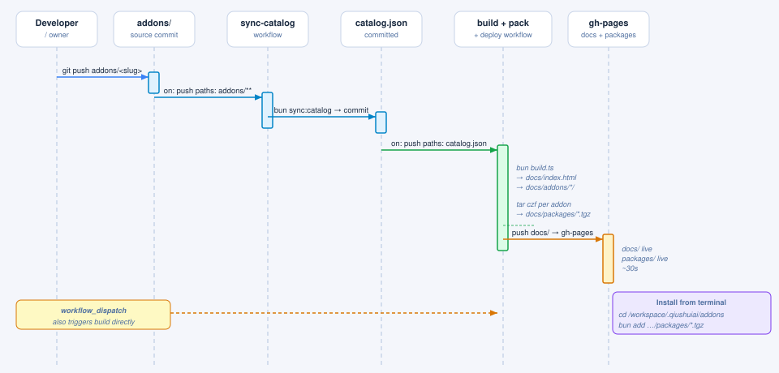

# piclaw-addons

面向 [piclaw](https://github.com/rcarmo/piclaw) 的社区扩展与附加组件。完整目录请访问 **[benjamin-qhy.github.io/qiushuiai-addons](https://benjamin-qhy.github.io/qiushuiai-addons/)**。

仓库开发和软件包生成需要 Bun 1.4.0 或更高版本。Bun 1.3 无法读取第 2 版锁文件；如果将仓库工具链回退到 Bun 1.4 以下，还必须一并撤销锁文件迁移。

> **智能体须知：**如何添加、修改和测试附加组件，请参阅 [AGENTS.md](AGENTS.md)。

---

## 安装附加组件

> **重要：**第一方 `piclaw-addons` 必须通过**由 GitHub 公开托管的 tarball URL** 安装。
> **不要**将示例、目录条目或运行时代码改成 npmjs.org 软件包说明，或改为通过身份验证读取 GitHub Packages。
> 运行时安装和移除必须无需软件包注册表身份验证即可完成。

### Web 界面（推荐）

打开**设置 → 附加组件**，选择一个附加组件，然后点击**安装**。重新加载 Piclaw，以启用新安装的运行时或 Web 入口。

### `pi install`

```bash
pi install https://rcarmo.github.io/piclaw-addons/packages/piclaw-addon-proxmox-0.1.8.tgz
```

### `bun add`

```bash
cd /workspace/.pi/extensions
bun add https://rcarmo.github.io/piclaw-addons/packages/piclaw-addon-proxmox-0.1.8.tgz
```

---

## 设置面板与配置

附加组件设置面板是从 `pi.web.entries` 加载的**浏览器模块**。

请按以下方式划分职责：

- **浏览器面板（`web/index.ts`）**
  - 使用 `globalThis.__piclawSettingsPaneRegistry` / `globalThis.__piclaw_web?.registerSettingsPane` 注册面板
  - 使用 `globalThis.__piclawPreactHtm` / `globalThis.__piclawPreact`
  - 通过 `GET` / `POST /agent/addons/api/<addon>/<action>` 读写非敏感配置；`config` 是常用的设置操作
  - 通过 `GET` / `POST /agent/keychain` 存储密钥
- **运行时入口（`index.ts` / `extension.ts`）**
  - 使用 `globalThis.__piclaw_registerAddonConfigApi(...)` 注册配置处理器
  - 将非敏感值保存在扩展 KV / 运行时存储中
  - 将令牌和密码保存在密钥链中

**不要**基于内部斜杠命令桥接机制构建新的设置面板。Piclaw 保留该路径，只是为了向旧版附加组件提供兼容性回退方案。

对于提供实质性 Web 界面的附加组件，最好在 `addons/<slug>/assets/` 下提交至少一张截图，并在附加组件的 README 中引用。
拍摄设置面板截图时，应将 microVM 用作干净的测试环境：优先采用基于 overlayfs 的临时附加组件视图，只拍摄目标面板，然后恢复 `cheapskate`，以便 microVM 可继续用于测试。

另请参阅：
- [AGENTS.md](AGENTS.md)
- [docs/architecture.md](docs/architecture.md)
- [`addons/sample-addon/README.md`](addons/sample-addon/README.md)

---

## 可用附加组件

| 附加组件 | 说明 |
|---|---|
| [`ast-grep-tool`](addons/ast-grep-tool/) | 将 ast-grep 作为原生大语言模型工具，进行结构化代码搜索和重写 |
| [`autoresearch`](addons/autoresearch/) | 自主实验循环子智能体（通过 tmux 提供启动、停止和状态工具） |
| [`cheapskate`](addons/cheapskate/) | 免费层提供商自动轮换——选择 cheapskate/auto 作为模型后，它会在已配置的免费层后端（Gemini、Cerebras、Groq、SambaNova、OpenRouter、OpenCode Zen、NVIDIA、Cloudflare）之间透明路由 |
| [`code-validator`](addons/code-validator/) | 代码验证诊断工具（支持 Python、JS/TS、JSON，并可通过 validators.json 扩展） |
| [`codex-conversion`](addons/codex-conversion/) | 供 Piclaw 中 OpenAI/Codex 类模型使用的 Codex 风格提示词与工具适配器 |
| [`delegate`](addons/delegate/) | 通过确定性的层级安全选择，将任务委派给经过验证、成本更低或速度更快的子 Pi 模型 |
| [`dev-tools`](addons/dev-tools/) | 用于工作区诊断和环境检查的开发者工具 |
| [`diagram-tools`](addons/diagram-tools/) | 架构图工作流——JSON 图定义、SVG 渲染器和彩色选择器小组件 |
| [`drawio-editor`](addons/drawio-editor/) | 集成工作区文件的自托管 draw.io 图表编辑器 |
| [`editable-table`](addons/editable-table/) | Web 界面中的可编辑 Markdown 表格小组件——打开带主题的电子表格式网格，并将编辑后的 Markdown 表格插回聊天 |
| [`eml-viewer`](addons/eml-viewer/) | 在 Web 时间线中预览电子邮件消息（.eml）附件的路由 |
| [`export-timeline-pdf`](addons/export-timeline-pdf/) | 将聊天时间线导出为 PDF，并包含行内头像和被引用消息的胶囊标签 |
| [`ghostty-terminal`](addons/ghostty-terminal/) | 面向高端 Piclaw 浏览器的现代化 Ghostty-web 终端面板渲染器，功能更丰富 |
| [`git-query-tools`](addons/git-query-tools/) | 供 piclaw 智能体使用的 Git 历史记录与 JSON 查询工具 |
| [`goal`](addons/goal/) | Codex 风格的持久化任务目标，配有强化的自主续行循环，以及可见的完成和停止摘要 |
| [`image-processing`](addons/image-processing/) | 供 Piclaw 使用的图像处理工具（image_process）——通过 sharp 实现缩放、裁剪、转换、合成等操作 |
| [`imap`](addons/imap/) | IMAP 邮件管理工具——支持搜索和获取、移动和复制、标记、创建草稿、归档邮件以及 STARTTLS |
| [`kanban-board-widget`](addons/kanban-board-widget/) | 面向工作区工作项、由文件支持的看板页面和移动 API |
| [`kanban-editor`](addons/kanban-editor/) | 工作区 .kanban.md 编辑器附加组件，支持看板之间的 Obsidian 风格 [[链接]] |
| [`late-night-regrets`](addons/late-night-regrets/) | 贝叶斯交互质量分类器脚本，以及可选的定时反思技能 |
| [`lite-term`](addons/lite-term/) | 与 Piclaw 内置默认终端完全相同的 xterm.js 终端面板，也是定制终端的良好起点 |
| [`mindmap`](addons/mindmap/) | 供 Piclaw 中 .mindmap.yaml 文件使用、基于 D3 的思维导图编辑面板 |
| [`observability`](addons/observability/) | OpenTelemetry 可观测性——将多个 piclaw 实例中的错误和智能体轮次追踪到 Azure Application Insights（含实时指标）及本地 Graphite |
| [`office-tools`](addons/office-tools/) | 供 Piclaw 使用的 Office 文档读写工具（DOCX、XLSX、PPTX，以及 Markdown 转 PDF） |
| [`office-viewer`](addons/office-viewer/) | 供 Piclaw 使用的 Office 文档查看器（.docx、.xlsx、.pptx、.odt、.ods、.odp） |
| [`plan-sidebar`](addons/plan-sidebar/) | 右侧会话计划侧边栏，采用规范的 plan action=update 和 Markdown 存储 |
| [`portainer`](addons/portainer/) | Portainer 管理工具——提供会话范围的 API 配置、临时请求，以及针对端点、栈、容器、镜像、网络和卷的编排工作流 |
| [`proxmox`](addons/proxmox/) | Proxmox VE 管理工具——提供会话范围的 API 配置、临时请求，以及针对虚拟机、LXC 容器、存储、任务和指标的编排工作流 |
| [`sample-addon`](addons/sample-addon/) | 示例附加组件——展示设置面板、密钥链密钥、SQLite KV 配置和测试端点的入门模板 |
| [`session-dashboard`](addons/session-dashboard/) | 可下拉的活动会话仪表板，展示近期工作摘要和上下文指标 |
| [`session-tree`](addons/session-tree/) | 供 Piclaw `/tree` 命令使用的交互式会话树时间线小组件 |
| [`settings-dialog-screenshot`](addons/settings-dialog-screenshot/) | 仅用于截取 Pi Web 设置对话框紧密裁剪截图的开发者技能 |
| [`skill-model-effort`](addons/skill-model-effort/) | 遵循 Piclaw 技能前置元数据中的模型、投入程度和思考配置 |
| [`smart-compaction`](addons/smart-compaction/) | 面向原版 pi 用户、兼容 Pi 的独立智能压缩扩展；Piclaw 已原生包含此行为。 |
| [`stealth-browser`](addons/stealth-browser/) | 通过 mochi.js 实现隐蔽浏览器自动化——模拟真人交互、保持指纹一致并绕过反检测机制 |
| [`telegram`](addons/telegram/) | PiClaw 的 Telegram 机器人渠道。通过 Bot API 长轮询连接、收发消息，并经由智能体路由消息。 |
| [`vent`](addons/vent/) | 工作区情绪日志附加组件，改编自 Igor Warzocha 的 pi-vent，可配置输出文件 |
| [`voice-pipeline`](addons/voice-pipeline/) | 仅适用于 ESPHome 的语音助手管线，面向 ThinkSmart/ESP32-Audio 设备，使用 Azure STT/TTS 和当前 Piclaw 聊天运行时 |
| [`web-viewer`](addons/web-viewer/) | 供 Piclaw 使用的 HTML、图像和视频查看面板与路由 |
| [`whatsapp`](addons/whatsapp/) | Piclaw 的 WhatsApp 渠道源；当前软件包并非独立自包含，不适合通过独立目录使用 |
| [`win-ui`](addons/win-ui/) | 通过 Win32 UI Automation 和截图实现 Windows 桌面自动化的工具 |
| [`writer-fonts`](addons/writer-fonts/) | 通过编辑器页脚中的下拉菜单切换文档编辑器字体——内置 Literata、Inter、Noto Sans、Noto Sans TC、New Tegomin 和 IBM Plex Sans，并提供 Georgia 及随附的 System 字体栈 |
| [`yolo-vibe`](addons/yolo-vibe/) | 安装在底部操作栏中的输入框 YOLO 按钮（继续、审查、文档），悬停前保持低调 |
| [`yolochat`](addons/yolochat/) | 零护栏的实例间消息传递——让各 Pi 实例通过 HTTP 相互发帖和回复 |

---

## 发布工作流



合并拉取请求后，可在 `main` 上触发相互独立的工作流：

1. **validate-metadata**——在拉取请求和 `main` 上检查目录元数据与 Earendil 兼容层
2. **sync-catalog**——附加组件或目录脚本发生变更后，重新生成 `catalog.json` 和根目录 `package.json` 的元数据
3. **build + deploy**——附加组件、目录、资源或构建发生变更后，重新构建网站和公开的 `.tgz` 文件
4. **publish**——将已提升版本号的附加组件镜像到 GitHub Packages，供归档或以其他方式使用

受支持的第一方运行时安装路径是 **GitHub Pages tarball URL**，而不是通过 npm 注册表解析。

---

## 参与贡献

如何添加新的附加组件、运行元数据检查和进行本地测试，请参阅 [AGENTS.md](AGENTS.md)。
