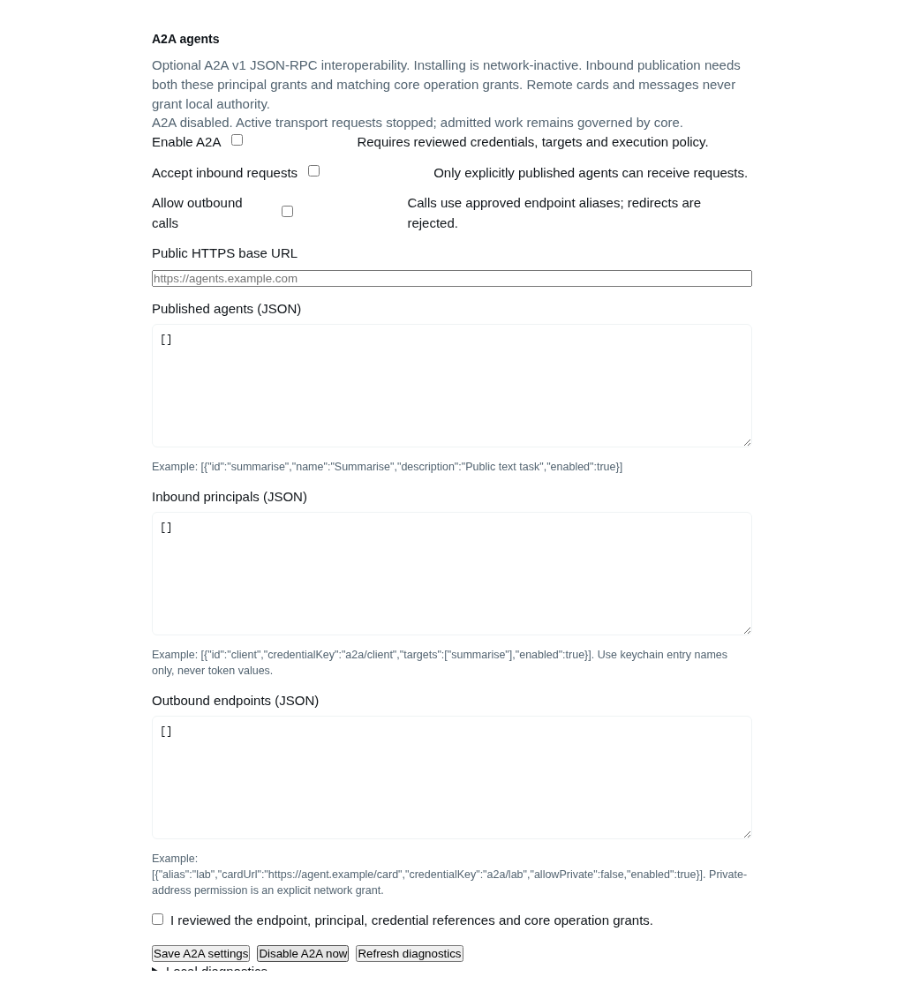
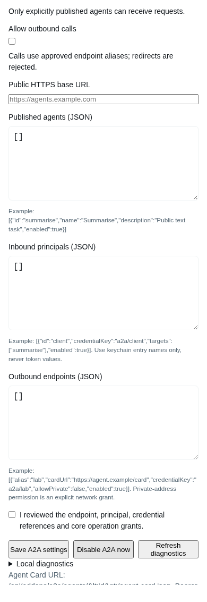

# A2A agents

Optional A2A v1 JSON-RPC client/server integration. **Disabled by default.** Incoming requests require bearer credentials, an add-on principal/target grant, and an independently configured core operation grant. Remote cards or messages never grant execution authority.

Requires the generic operation API in [Piclaw PR #1337](https://github.com/rcarmo/piclaw/pull/1337). Older runtimes expose disabled diagnostics and cannot fall back to raw chat/enqueue. The protocol/SDK, authentication, transport, task store, operator pane and agent tool all live in this add-on.

## Capabilities

| Surface | Implemented profile |
|---|---|
| Version/binding | A2A specification 1.0.1, wire `A2A-Version: 1.0`, JSON-RPC 2.0/PascalCase methods |
| Discovery | Explicit authenticated card URL: `/api/addons/a2a/agents/<id>/agent-card.json` |
| Task methods | SendMessage, GetTask, ListTasks, CancelTask, SendStreamingMessage, SubscribeToTask |
| Data | Text, JSON objects and UTF-8 inline text/JSON files; 24 KiB decoded data per message; no URI fetching or binary formats |
| Results | Caller-owned text artifact; bounded task history; immutable terminal state |
| Runtime | Generic admitted operation, independent durable result storage, explicit continuation/cancel and conservative restart reconciliation |
| Outbound | Approved endpoint aliases, pinned-address transport, bearer keychain refs; local task ownership by current verified work scope |
| Optional cards | Private ETag revalidation, work/credential-scoped cache, pinned Ed25519 signing/verification; operator-configured well-known proxy alias |
| Optional push | Approved authenticated callbacks, durable bounded outbox and task-scoped receive-only inbox; separately disabled by default |
| Excluded | Legacy protocol 0.3 compatibility, gRPC/REST bindings, extended/public redacted cards, multi-hop/family exposure |

The official SDK is pinned to `@a2a-js/sdk@1.1.0` with versioned schema/provenance under [protocol/](protocol/provenance.json). The production handler uses its codecs/error/dispatch/client layers; it does not use the SDK demo task store or event-bus execution handler. Those demos cannot independently persist terminal results after consumers disconnect.

## Optional discovery and card trust

See [Agent Card discovery and trust](docs/card-discovery.md) for an exact reverse-proxy well-known alias, optional endpoint cache TTL (0–300 seconds), pinned public-key validity/rotation, and keychain-backed server signing. Defaults remain uncached and unsigned; signatures never grant execution rights. No remote JWK URLs are fetched.

## Optional push

See [push notifications](docs/push-notifications.md) for the separate opt-in, exact callback URL/principal grants, Bearer credential matching, durable retry and receive-only task correlation. Push is not enabled by card discovery or signing.

## Configure safely

Open Settings → Add-ons → A2A. The pane uses `/agent/addons/api/a2a` directly; no slash-command bridge. Token values belong in Keychain settings. A2A config stores key names only. Installation registers a bounded handler when the host API exists; disabled requests return 404 and no task database/listener is created by this package.

1. Keep Enable A2A off while configuring.
2. Add a published agent, for example `[{"id":"summarise","name":"Summarise","description":"Public text task","enabled":true}]`.
3. Add a principal: `[{"id":"client","credentialKey":"a2a/client","targets":["summarise"],"enabled":true}]`. Use a random bearer credential of at least 24 characters in the keychain. Shared credential references between principals are rejected.
4. Configure the corresponding host `domains.operations` grant with `addonId: "a2a"`, that principal and target. Start text-only (empty tools). See Piclaw's generic [operation guide](https://github.com/rcarmo/piclaw/blob/main/docs/addon-operations.md). Add-on installation/config cannot create those core grants.
5. Set the public HTTPS origin and inbound toggle; review grants and confirm enablement. Publish only the explicit card URL. Reverse proxy must preserve response SSE and HTTPS; cross-origin/browser credentials are not used.
6. Outbound endpoints need an explicit alias/card URL and optional keychain reference. `allowPrivate` defaults false in operator examples and must be deliberately enabled for private networks/loopback fixtures. Every DNS result is checked and one validated address is pinned into the real connection; redirects and cross-origin credentials are refused.

Disabling or changing settings aborts transport consumers and prevents new admissions. It does not falsely mark already admitted core work cancelled. Core grants remain independently revocable. Removing the add-on unregisters routes and closes stores; retain the versioned SQLite files for audit/rollback. Do not delete Piclaw's messages database.

**Tool allowlists are not filesystem sandboxes.** Core operation sessions exclude ambient workspace instructions, skills, extensions and MCP, but granted read/write/shell tools retain their process authority. Use text-only grants or a separate operator-reviewed sandbox for untrusted clients.

## Agent tool

`a2a` provides status/profile, discover, send, get, cancel, subscribe and list. Each network action requires an enabled endpoint alias and active core-admitted work scope. `list` lists only locally remembered remote tasks for that scope, not every task visible to a shared remote service credential.

Send requires a stable `messageId`. The client explicitly requests `returnImmediately: true`; default inbound SendMessage honours the normative blocking default. Repeating the same accepted message returns its stored receipt. An uncertain request is marked unknown and is never automatically resubmitted. Query known task IDs or reconcile with the peer/operator before retrying work that may have side effects. Core/A2A IDs are separate.

Outbound network calls recheck the current core work and applicable budget caps via the startup-owned adapter; missing work/capability or paused/exhausted work fails closed. Remote billing remains unknown unless reported; it is never fabricated as local usage.

Responses are labelled untrusted, truncated at 32 KiB in tool output, and never treated as permissions or instructions from the operator. A remote bill cannot be inferred from local token usage.

## Limits and durability

- Inbound: 32 KiB HTTP body; eight parts/24 KiB decoded data; 100 history entries; 1,000 retained tasks/principal; 120 requests/minute/principal; 16 active requests; 30-second transport deadline. Core applies additional work/budget/tool caps.
- JSON/stream: 256 KiB response/frame, 2 MiB cumulative stream. Caller abort cleans up idle subscription work; it does not cancel the durable task. Task snapshots begin each stream/resubscription; no fabricated Last-Event-ID replay support.
- Outbound: same-origin interface selection, 64 KiB request, 128 KiB card, 2 MiB response/stream; 16 active calls and 30-second end-to-end scope. Credential refs are resolved fresh, never persisted in task stores.
- Tasks/contexts/messages live in `tasks-v1.sqlite`; outbound identities in `outbound-v1.sqlite`, under the host-owned add-on directory. Modes are private and writes transactional. Task IDs/context reuse/page tokens are caller-bound. List ordering is latest status first and cursors are HMAC-protected/filter-bound.
- Core operation results persist independently of HTTP consumers. Reads reconcile durable protocol state; restart does not blindly replay uncertain execution. A pending/unknown continuation cannot be resent without explicit reconciliation. Operator-only terminal pruning is exposed by `POST /agent/addons/api/a2a/tasks` with `{principal,before}`; nonterminal and other-principal records are retained.
- Push methods return explicit unsupported errors while disabled; extended-card methods remain unsupported. Unexpected provider/store exception text is suppressed in public JSON-RPC responses.

## Evidence and tests

Run from repository root with test filesystem preloads intact:

```sh
bun install --frozen-lockfile
bun run typecheck:a2a
bun test addons/a2a
bun run check:catalog
```

Explicit companion-source integration and isolated browser fixture:

```sh
PICLAW_E2E_DISPOSABLE=1 PICLAW_A2A_CORE_SOURCE=/absolute/path/to/piclaw \
PLAYWRIGHT_BROWSERS_PATH=/absolute/path/to/ms-playwright \
  bun test addons/a2a/host-integration.test.ts addons/a2a/settings-browser.test.ts
```

These start only disposable loopback listeners/temp state; no production server/provider is called. The host integration runs against the actual Piclaw route registry and operation service with a fake executor. Independent hand-written v1 wire fixtures test outbound behaviour; official SDK clients test inbound. This is not a third-party deployment certification. [A1 historical SDK findings](docs/profile.md) remain useful context; [service evidence](docs/service-validation.md) records current gates and limitations.

## Operator pane captures




The original captures above are local fixtures. The [packaged deployment canary](docs/deployment-canary.md) also passed on VM900/radxax4 with actual Classic/Visual desktop/mobile captures, actual AgentPool execution and independent Python client. The VM was restored to its original stopped snapshot; production remains unchanged.
